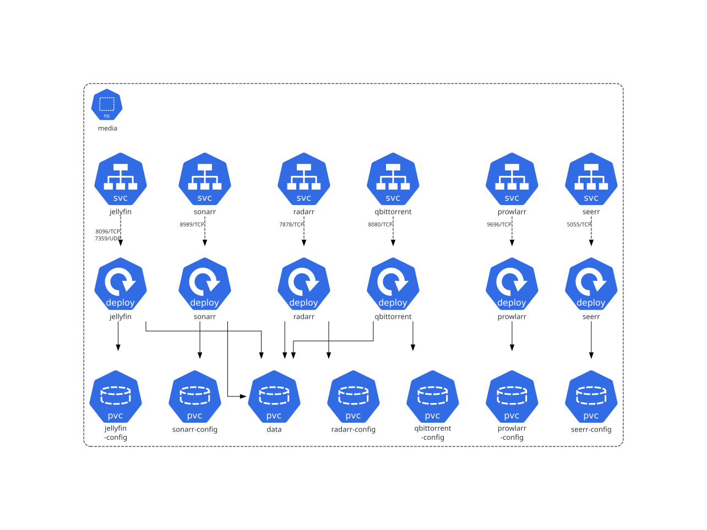
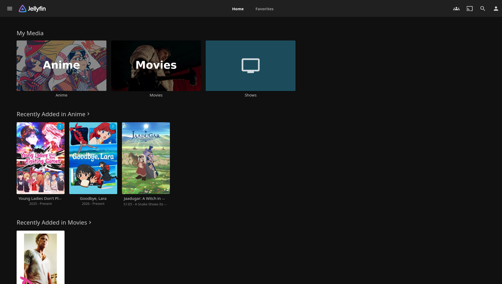
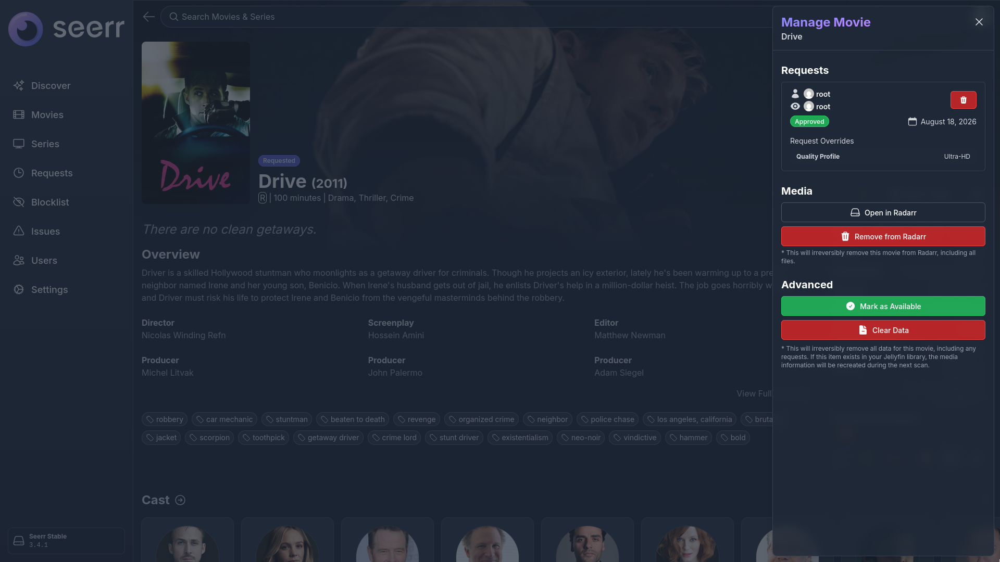
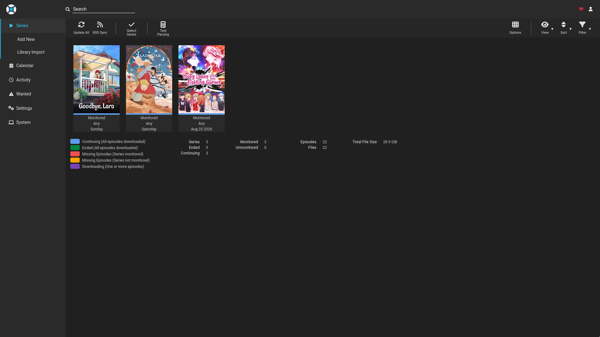
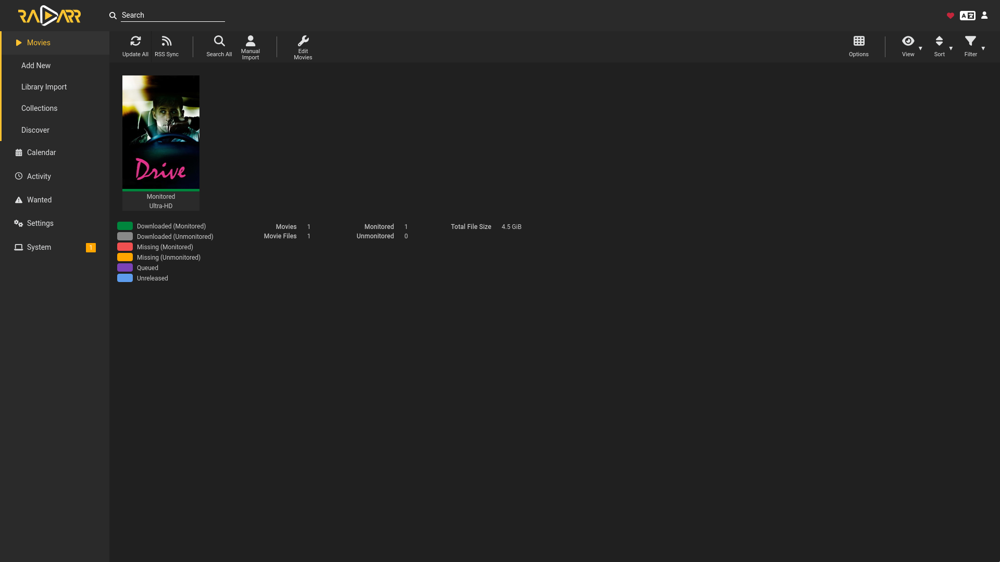
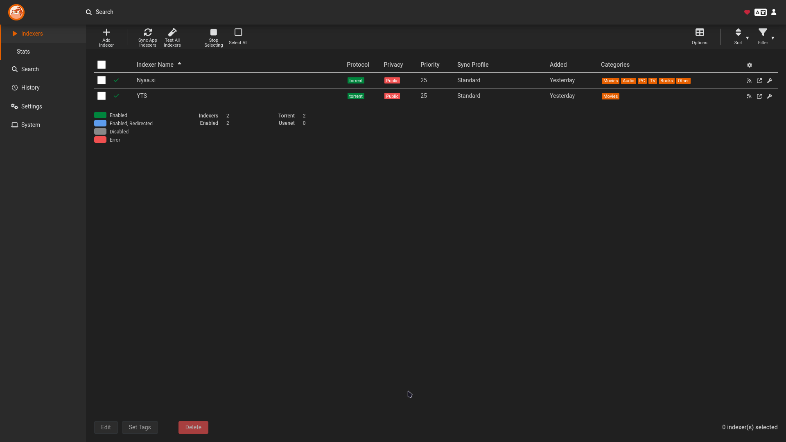
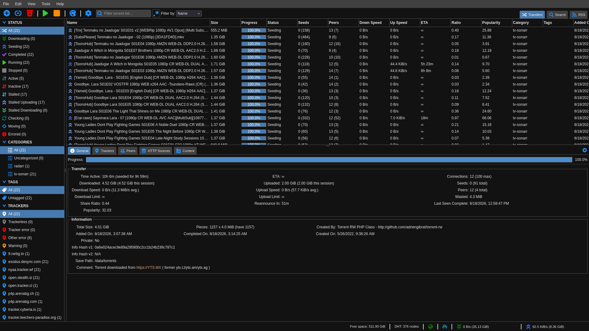

# Jellyfin media server

This repository contains the manifests for the media stack running on my k3s
homelab. It started as a small Jellyfin deployment and grew to include the usual
automation tools around it.

The stack runs in the `media` namespace and consists of:

- Jellyfin for serving the library
- Seerr for media requests
- Sonarr and Radarr for library management
- Prowlarr for indexer management
- qBittorrent for downloads, with its traffic routed through a Proton WireGuard
  connection

This is how all these applications work together:


And this is how the stack is deployed in Kubernetes (props to Kubediagrams for automatically generating this):



## Screenshots

<table>
  <tr>
    <td width="50%" align="center">
      <a href="docs/screenshots/jellyfin-ui.png"></a>
      <br><sub><b>Jellyfin</b></sub>
    </td>
    <td width="50%" align="center">
      <a href="docs/screenshots/seerr-ui.png"></a>
      <br><sub><b>Seerr</b></sub>
    </td>
  </tr>
  <tr>
    <td width="50%" align="center">
      <a href="docs/screenshots/sonarr-ui.png"></a>
      <br><sub><b>Sonarr</b></sub>
    </td>
    <td width="50%" align="center">
      <a href="docs/screenshots/radarr-ui.png"></a>
      <br><sub><b>Radarr</b></sub>
    </td>
  </tr>
  <tr>
    <td width="50%" align="center">
      <a href="docs/screenshots/prowlarr-indexers.png"></a>
      <br><sub><b>Prowlarr</b></sub>
    </td>
    <td width="50%" align="center">
      <a href="docs/screenshots/qbittorrent-ui.png"></a>
      <br><sub><b>qBittorrent</b></sub>
    </td>
  </tr>
</table>

## How it works

Jellyfin and Seerr use `LoadBalancer` Services. We don't support autoscaling, but using the ServiceLB included in k3s is convenient because it uses the expected ports instead of NodePorts in the Kubernetes range.

The administration interfaces for Sonarr, Radarr, Prowlarr, and qBittorrent
remain inside the cluster and can be reached locally with `port-forward.sh`.
The script is just a wrapper around `kubectl port-forward` calls for each app.

| Application | Port | Service type |
| --- | ---: | --- |
| Jellyfin | 8096/TCP, 7359/UDP | LoadBalancer |
| Seerr | 5055/TCP | LoadBalancer |
| Sonarr | 8989/TCP | ClusterIP |
| Radarr | 7878/TCP | ClusterIP |
| Prowlarr | 9696/TCP | ClusterIP |
| qBittorrent | 8080/TCP | ClusterIP |

## Storage

This setup uses static local PersistentVolumes rather than a dynamic storage
provisioner. Every PV is tied to the node named `walnut` and uses a path below
`/home/felipe/jellyfin`.

There is one 100 Gi volume shared by Sonarr, Radarr, qBittorrent, and Jellyfin.
Each application also has its own configuration volume. The reclaim policy is
`Retain`, so deleting a claim does not remove the files from disk.

Jellyfin also needs a cache to write transcoding segments and other temporary files.
It is mounted as an emptyDir ephemeral volume, so it follows the Pod lifecycle (eg. we don't keep stale caches when rolling out a Deployment update).

Before applying the manifests, create the directories used by the volumes:

```bash
mkdir -p data/media
mkdir -p app-config/{jellyfin,prowlarr,qbittorrent,radarr,seerr,sonarr}
```

If this is being deployed somewhere else, update the hostname and local paths
in `kubernetes/storage/` first. Local volumes also mean that these workloads
cannot move to another node unless the storage is moved with them.

## Deploying

The cluster needs to have a working `LoadBalancer` implementation. k3s includes
ServiceLB by default unless it has been disabled.

Apply the namespace and storage before the workloads:

```bash
kubectl apply -f kubernetes/namespace.yaml
kubectl apply -f kubernetes/storage/

for app in jellyfin prowlarr qbittorrent radarr seerr sonarr; do
  kubectl apply -f "kubernetes/$app/"
done
```

Check that everything came up:

```bash
kubectl get deployments,services,pvc -n media
kubectl get pv
```

To open the internal dashboards on localhost:

```bash
./port-forward.sh
```

The qBittorrent container expects its WireGuard configuration in its persistent
`/config` volume. VPN credentials and generated application configuration are
local runtime data and are ignored by Git.

I use the `hotio` image for qBittorrent because it has WireGuard bundled.
It creates a network adapter named `wg0` for the qBittorrent Pod, and we can configure QBittorrent to exclusively bind to this adapter.
If the VPN goes down for some reason (eg. Proton server becomes unavailable), QBittorrent cannot send or receive any data in the P2P network, so we are always protected.
